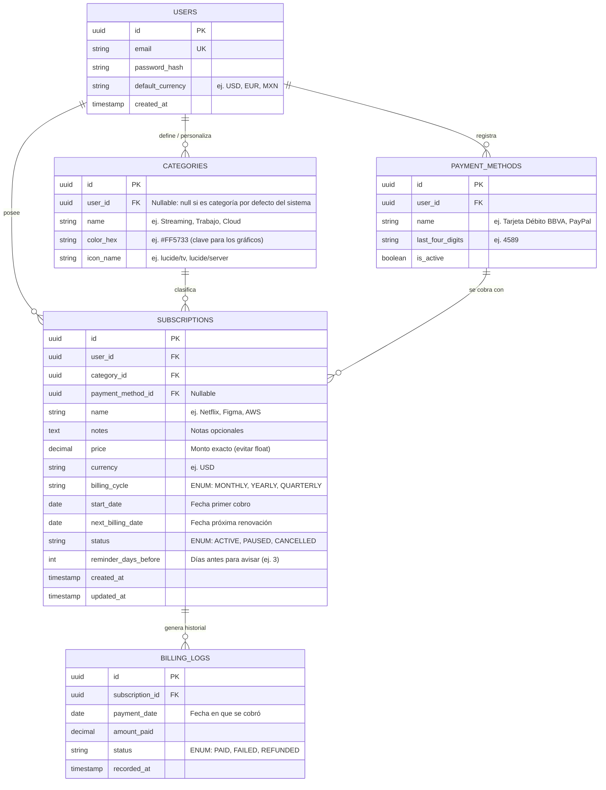

```mermaid
erDiagram
    USERS ||--o{ CATEGORIES : "define / personaliza"
    USERS ||--o{ PAYMENT_METHODS : "registra"
    USERS ||--o{ SUBSCRIPTIONS : "posee"
    CATEGORIES ||--o{ SUBSCRIPTIONS : "clasifica"
    PAYMENT_METHODS ||--o{ SUBSCRIPTIONS : "se cobra con"
    SUBSCRIPTIONS ||--o{ BILLING_LOGS : "genera historial"

    USERS {
        uuid id PK
        string email UK
        string password_hash
        string default_currency "ej. USD, EUR, MXN"
        timestamp created_at
    }

    CATEGORIES {
        uuid id PK
        uuid user_id FK "Nullable: null si es categoría por defecto del sistema"
        string name "ej. Streaming, Trabajo, Cloud"
        string color_hex "ej. #FF5733 (clave para los gráficos)"
        string icon_name "ej. lucide/tv, lucide/server"
    }

    PAYMENT_METHODS {
        uuid id PK
        uuid user_id FK
        string name "ej. Tarjeta Débito BBVA, PayPal"
        string last_four_digits "ej. 4589"
        boolean is_active
    }

    SUBSCRIPTIONS {
        uuid id PK
        uuid user_id FK
        uuid category_id FK
        uuid payment_method_id FK "Nullable"
        string name "ej. Netflix, Figma, AWS"
        text notes "Notas opcionales"
        decimal price "Monto exacto (evitar float)"
        string currency "ej. USD"
        string billing_cycle "ENUM: MONTHLY, YEARLY, QUARTERLY"
        date start_date "Fecha primer cobro"
        date next_billing_date "Fecha próxima renovación"
        string status "ENUM: ACTIVE, PAUSED, CANCELLED"
        int reminder_days_before "Días antes para avisar (ej. 3)"
        timestamp created_at
        timestamp updated_at
    }

    BILLING_LOGS {
        uuid id PK
        uuid subscription_id FK
        date payment_date "Fecha en que se cobró"
        decimal amount_paid
        string status "ENUM: PAID, FAILED, REFUNDED"
        timestamp recorded_at
    }
```
